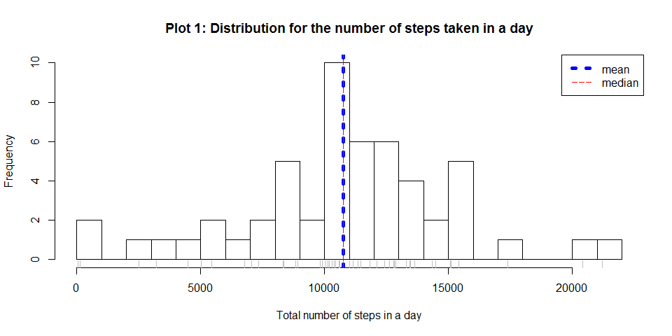

# Peer-graded Assignment: Course Project 1


---
title: "PA1_template.Rmd"
author: "Julian Buhagiar"
date: 2017-04-07
output: html_document
---

date last modified: 2017-04-07 


## Questions

[What is mean total number of steps taken per day?][1]
      
[What is the average daily activity pattern?][2]
      
[Are there differences in activity patterns between weekdays and weekends?][3]


## Description

This assignment makes use of data from a personal activity monitoring device. 
This device collects data at 5 minute intervals through out the day. The data 
consists of two months of data from an anonymous individual collected during 
the months of October and November, 2012 and include the number of steps taken 
in 5 minute intervals each day.

```r
URL = "https://d396qusza40orc.cloudfront.net/repdata%2Fdata%2Factivity.zip"
```

## Variables

### pre-process

included in the source dataset are:

• `steps`: Number of steps taking in a 5-minute interval (missing values are coded as NA)

• `date`: The date on which the measurement was taken in YYYY-MM-DD format

• `interval`: Identifier for the 5-minute interval in which measurement was taken

### post-process
included in the final dataset are:

• `sourcedData`: The data.frame that was read into R

• `timeOnly`: A variable constructed which converts the interval into a time
Note that this stores the current system time data with this value which is to be 
disregarded for the analysis

• `time`: A variable constructed which joins the observation date with the time

• `constructedData`: This is a transformed version of the `sourcedData` data.frame 
where all NAs have been replaced with the average value for the interval.

• `Q1`: This is the data.frame associated with Question 1 output

• `Average.StepsPerDay`: A list containing the median and mean in answer to Question 1

• `Q2`: This is the data.frame associated with Question 2 output

• `activityPeak`: A list containing the lower and upper bounds for the most active 
interval n answer to Question 2

## System Info and Library Prerequisites

### System

```
## R version	R version 3.3.2 (2016-10-31)
```

```
## OS	mingw32
```
### Libraries


```
## dplyr 0.5.0 was used during for the production of this analysis
```

```
## stringr 1.1.0 was used during for the production of this analysis
```
### Prerequisite Common Functions

#### Workspace Housekeeping

`keep()`is an internal function which keeps a record of the important variables 
that the script will retain in the workspace following the running of the code.

`cleanWorkspace()` is a finalising function which removes the `<<-` variables that 
aren't intended to be retained after the running of the function.

```r
keep<-function(...){
      #>DESCRIPTION----
      # keeps a record of starting globals
      # and appends the desired variables that we wish to keep by the end of the 
      # script, thereby making all other variables and functions that are made during 
      # the running of this function as temporary.
      if(!exists("GlobalEnvKeep")){
            GlobalEnvKeep<<-c(ls(envir = as.environment(globalenv())))
      }
      GlobalEnvKeep<<-c(GlobalEnvKeep,...)
}
keep() 
cleanWorkspace<-function(){
      rm(list= ls(envir=as.environment(globalenv()))[!(ls(envir=as.environment(globalenv())) %in% GlobalEnvKeep )],
         envir=as.environment(globalenv()))
      rm(keep,envir=as.environment(globalenv()))
}
```

#### Retrieve data files

`sourceData()` is used to download the data to the workspace and the working folder.


```r
sourceData<-function(src=URL,expectedfiles="activity.csv",workspaceNames="sourcedData"){
      
      
      if(!file.exists(expectedfiles)){
            message("downloading files")
            download.file(src,"data.zip")
            unzip("data.zip")
            file.remove("data.zip")
      }
      
      columnClassPreDefined<-c("numeric","character","character")
      ## This first line will likely take a few seconds to load
      if (!exists(workspaceNames)){sourcedData<<- read.csv(expectedfiles,
                                                           colClasses=columnClassPreDefined,
                                                           header = TRUE,
                                                           stringsAsFactors = FALSE,
                                                           na.strings = "NA")
      #change the date column to a date type field
      sourcedData$date<<-as.Date(sourcedData$date)
      #pads the interval to become a 4 digit time
      sourcedData$interval<<-stringr::str_pad(sourcedData$interval,width=4,side="left",pad="0")
      # combines data and time into a single column called time
      sourcedData$time<<-paste(sourcedData$date,sourcedData$interval)
      sourcedData$time<<-as.POSIXct(strptime(sourcedData$time,"%Y-%m-%d %H%M"))
      sourcedData$timeOnly<<-as.POSIXct(strptime(sourcedData$interval,"%H%M"))
      ## retains the sourcedata variable for the project workspace
      keep("sourcedData")
      }
      # organising data----
      sourcedData<<-dplyr::tbl_df(sourcedData)
      
      message("Data loaded successfully into the workspace as 'sourcedData'")
      
      ##creates a container to keep useful metadata as a list
      metadata<<-list(NULL)
      metadata$head<<-(head(sourcedData))
      metadata$summary<<-summary(sourcedData)
      str(sourcedData)
      
}
```

## Analysis Run Sequence

The call to the function `sourceData()` loads the data into R.


```r
sourceData(URL)
```

```
## Data loaded successfully into the workspace as 'sourcedData'
```

```
## Classes 'tbl_df', 'tbl' and 'data.frame':	17568 obs. of  5 variables:
##  $ steps   : num  NA NA NA NA NA NA NA NA NA NA ...
##  $ date    : Date, format: "2012-10-01" "2012-10-01" ...
##  $ interval: chr  "0000" "0005" "0010" "0015" ...
##  $ time    : POSIXct, format: "2012-10-01 00:00:00" "2012-10-01 00:05:00" ...
##  $ timeOnly: POSIXct, format: "2017-04-07 00:00:00" "2017-04-07 00:05:00" ...
```

The data when it was loaded in shows there are 17568 observations 
and 3 variables. The `interval` variable represents a 
24 hour time and a new variable has been introduced called `time` joining the date 
and time together into a single POSIXct date time. The [variables][4] are 
called steps, date, interval, time, timeOnly.

Running `summary()` on the loaded data shows there are NA's   :2304  
The observations were taken between 2012-10-01, 2012-11-30.

### Question 1 - What is mean total number of steps taken per day?


```r
      Q1<-as.data.frame(summarise(group_by(sourcedData,date),
                                   sum(steps,na.rm = TRUE)
                                   ))
      names(Q1)<-c("date","steps.Total")
      keep("Q1")
      hist(as.matrix(Q1$steps.Total[Q1$steps.Total!=0]),
           xlab="Total number of steps in a day",
           main="Plot 1: Distribution for the number of steps taken in a day",
           breaks= 20)
      rug(as.matrix(Q1$steps.Total[Q1$steps.Total!=0]),col="grey")
      abline(v=mean(Q1$steps.Total[Q1$steps.Total!=0]),col="blue",lty=3,lwd=5)
      
      abline(v=median(Q1$steps.Total[Q1$steps.Total!=0]),col="red",lty=5,lwd=1)
      
      legend("topright",legend=c("mean","median"),col=c("blue","red"),lty=c(3,5),lwd=c(5,1))
```

<!-- -->


The total number of steps per day can be seen in the result of the `Q1` data.frame

Plot 1 shows an evenly balanced distribution with the most common
number of steps per day is between 10000 and 11000. The plot also shows that the 
mean and median are close to eachother indicating there is very little skew for 
this set of observations.


```r
      Average.StepsPerDay <- list(NULL)
      keep(Average.StepsPerDay)
      Average.StepsPerDay$mean <- as.integer(mean(Q1$steps.Total[Q1$steps.Total!=0]))
      Average.StepsPerDay$median <- as.integer(mean(Q1$steps.Total[Q1$steps.Total!=0]))
```
Excluding the days where no data was collected:

The **mean number** of steps taken per day are 
10766 (to nearest whole number).

The **median number** of steps taken per day are 
10766  (to nearest whole number).

### Question 2 - What is the average daily activity pattern?

Running `summary()` on the loaded data shows there are NA's   :2304  
The NA values occur for whole days so the script will attempt to impute values
based on the average interval.


```r
      Q2<-as.data.frame(summarise(group_by(sourcedData,timeOnly,interval),
                                  mean(steps,na.rm = TRUE)))
#create a subset of the data where NAs occur
      constructedData<-subset(sourcedData,is.na(sourcedData$steps))
#impute the average of the interval where there is the NA
      constructedData$steps<-Q2$`mean(steps, na.rm = TRUE)`
#bind the two dataframes together
      constructedData<-bind_rows(constructedData,subset(sourcedData,!is.na(sourcedData$steps)))
#reorder by time
      constructedData<-arrange(constructedData, time)
      
      str(constructedData)
```

```
## Classes 'tbl_df', 'tbl' and 'data.frame':	17568 obs. of  5 variables:
##  $ steps   : num  1.717 0.3396 0.1321 0.1509 0.0755 ...
##  $ date    : Date, format: "2012-10-01" "2012-10-01" ...
##  $ interval: chr  "0000" "0005" "0010" "0015" ...
##  $ time    : POSIXct, format: "2012-10-01 00:00:00" "2012-10-01 00:05:00" ...
##  $ timeOnly: POSIXct, format: "2017-04-07 00:00:00" "2017-04-07 00:05:00" ...
```

```r
      NAcount<-sum(is.na(constructedData$steps))
```

There were **2304 NAs** in the `sourcedData` data.
There are **0 NAs** in the `constructedData` data.


```r
      Q2<-as.data.frame(summarise(group_by(constructedData,timeOnly,interval),
                                   mean(steps,na.rm = TRUE)
                                   ))
      names(Q2)<-c("time","interval","steps.Mean")
      keep("Q2")
      
      with(constructedData,
           plot(x=timeOnly,
                y=steps,
                col=rgb(.5,.5,.5,.1),
                pch=20,
                ylab="Number of Steps",
                xlab="Time of Day",
                main = "Plot 2: Activity over a day"))
      
      with(Q2,points(x=time,
                     y=steps.Mean,col="red",
                     type="l",
                     ylim=c(0,max(sourcedData$steps,na.rm=TRUE))
                     ))
      
      legend("topright",
             legend=c("average number of steps at time interval"),
             col=c("red"),
             lty=c(1),
             lwd=c(1),
             box.col="transparent",
             bg = "transparent" )
```

<!-- -->
 
 The average activity across a day for the study period can be seen in Plot 2. 
 

```r
      activityPeak<-list(NULL)
      keep(activityPeak)
      activityPeak$most.lower<-format.Date(Q2$time[Q2$steps.Mean==max(Q2$steps.Mean)],"%T")
      activityPeak$most.upper<-format.Date(Q2$time[Q2$steps.Mean==max(Q2$steps.Mean)]+299,"%T")
```

The **most active time interval** is in the morning at **08:35:00**
- **08:39:59**


### Question 3 - Are there differences in activity patterns between weekdays and weekends?


[1]: https://github.com/JulesBuh/RepData_PeerAssessment/blob/master/PA1_template.md#question-1---what-is-mean-total-number-of-steps-taken-per-day

[2]: https://github.com/JulesBuh/RepData_PeerAssessment/blob/master/PA1_template.md#question-2---what-is-the-average-daily-activity-pattern

[3]: https://github.com/JulesBuh/RepData_PeerAssessment/blob/master/PA1_template.md#question-3---are-there-differences-in-activity-patterns-between-weekdays-and-weekends

[4]: https://github.com/JulesBuh/RepData_PeerAssessment/blob/master/PA1_template.md#variables
